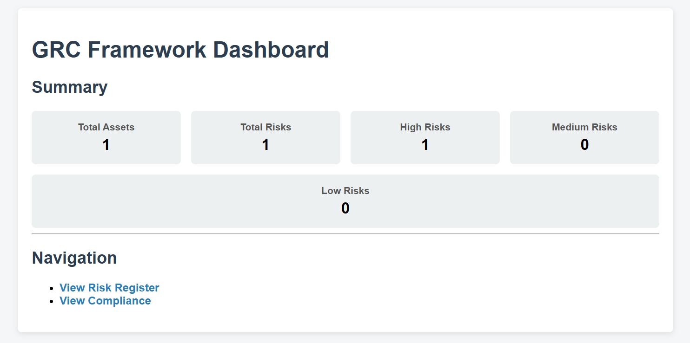
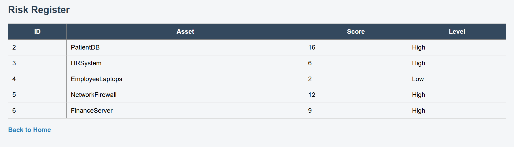
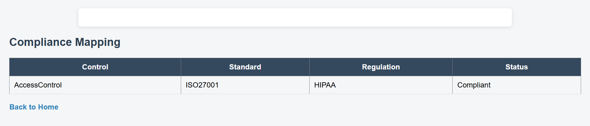

# GRC Framework MVP

This project is a web-based Governance, Risk, and Compliance (GRC) framework MVP designed for regulated organizations.

## Features
- Asset Register
- Risk Assessment (Likelihood × Impact)
- Risk Classification (High / Medium / Low)
- Control Library
- Compliance Mapping (ISO 27001, HIPAA)
- Dashboard Summary
- Web-based UI using Flask

## Tech Stack
- Backend: Python (Flask)
- Database: SQLite
- Frontend: HTML, CSS
- Styling: Custom CSS

## Screenshots

### Dashboard

### Risk Register

### Compliance Mapping

## Project Type
Final-year problem-based project.
